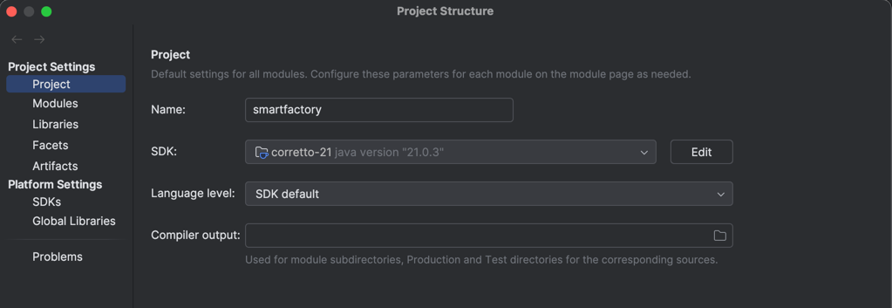

# SmartFactory API
#### built with https://readme.so/
## Configuración

- SDK corretto 21.0.3



## API Docs
[Swagger - OpenAPI 3.0](http://localhost:8080/swagger-ui/index.html)

## Api Reference

This API contract is made following the [JSend](https://github.com/omniti-labs/jsend) format.

⚠️ Message errors and exceptions not yet implemented ⚠️

### Tizadas

#### Retrieve all tizadas

```http
  GET /api/tizada
```

Example response:

Status code: 200 "OK"
```json
{
    "status": "OK",
    "data": [
        {
            "uuid": "2c587a40-3285-4188-8a26-e5417438c08c",
            "name": "Tizada de remeras",
            "parts": [
                {
                    "mold": {
                        "uuid": "2850e657-1df2-4e8f-b312-c16847ee742f",
                        "name": "Manga izquierda",
                        "description": "Art.02 lycra",
                        "area": 80.1,
                        "active": true,
                        "stock": 0,
                        "createdAt": "2024-09-23T01:38:21.715998",
                        "updatedAt": "2024-09-23T01:38:21.715998",
                        "deletedAt": "2024-09-23T01:38:21.715998"
                    },
                    "quantity": 15
                }
            ],
            "bin": "to be determined. Possibly URL of AWS bucket",
            "results": [
                {
                    "to be": "determined"
                }
            ],
            "state": "one of: <CREATED, IN_PROGRESS, FINISHED, ERROR>",
            "active": true,
            "createdAt": "2024-09-23T21:53:05.879323",
            "updatedAt": "2024-09-23T21:53:05.879323",
            "deletedAt": "2024-09-23T21:53:05.879323"
        }
    ]
}
```

#### Retrieve tizada by UUID

```http
  GET /api/tizada/${uuid}
```

| Parameter | Type     | Description                       |
| :-------- | :------- | :-------------------------------- |
| `uuid`      | `uuid` | **Required**. UUID of tizada to fetch |

Example response:

Status code: 200 "OK"
```json
{
    "status": "OK"
    "data": {
        "uuid": "2c587a40-3285-4188-8a26-e5417438c08c",
        "name": "Tizada de remeras",
        "parts": [
            {
                "mold": {
                    "uuid": "2850e657-1df2-4e8f-b312-c16847ee742f",
                    "name": "Manga izquierda",
                    "description": "Art.02 lycra",
                    "area": 80.1,
                    "active": true,
                    "stock": 0,
                    "createdAt": "2024-09-23T01:38:21.715998",
                    "updatedAt": "2024-09-23T01:38:21.715998",
                    "deletedAt": "2024-09-23T01:38:21.715998"
                },
                "quantity": 15
            }
        ],
        "bin": "to be determined. Possibly URL of AWS bucket",
        "results": [
            {
                "to be": "determined"
            }
        ],
        "state": "one of: <CREATED, IN_PROGRESS, FINISHED, ERROR>",
        "active": true,
        "createdAt": "2024-09-23T21:53:05.879323",
        "updatedAt": "2024-09-23T21:53:05.879323",
        "deletedAt": "2024-09-23T21:53:05.879323"
    }
}
```

#### Queue new tizada

This is the request made for a new tizada, made by the frontend to the API.

```http
POST /api/tizada
```

Example request body:
```json
{
    "width": 500,
    "height": 400,
    "name": "Tizada de pantalones",
    "tizadaType": "one of <RAPIDA, CUSTOM>...to be determined",
    "wastePercentage": 72,
    "maxTime": 10,
    "molds": [
        {
            "uuid": "2850e657-1df2-4e8f-b312-c16847ee742f",
            "quantity": 15
        },
        {
            "uuid": "77b221f3-663c-4331-837b-3c641aaccecb",
            "quantity": 6
        }
    ]
}
```

Example response. It's the tizada created and sended to tizada microservice to calculate:

Status code: 201 "CREATED"
```json
{
    "status": "CREATED",
    "data": {
        "uuid": "b7a5b379-86ba-40fc-9e2b-0931e8bf5653",
        "name": "Tizada de pantalones",
        "parts": [
            {
                "mold": {
                    "uuid": "2850e657-1df2-4e8f-b312-c16847ee742f",
                    "name": "Molde 2",
                    "url": "bucket.com",
                    "description": "Art.1111",
                    "area": null,
                    "active": true,
                    "stock": 0,
                    "createdAt": "2024-09-23T01:38:21.715998",
                    "updatedAt": null,
                    "deletedAt": null
                },
                "quantity": 15
            },
            {
                "mold": {
                    "uuid": "77b221f3-663c-4331-837b-3c641aaccecb",
                    "name": "Molde 1",
                    "url": "bucket2.com",
                    "description": "Art.01 algodón, color azul",
                    "area": null,
                    "active": true,
                    "stock": 0,
                    "createdAt": "2024-09-23T01:38:15.754972",
                    "updatedAt": null,
                    "deletedAt": null
                },
                "quantity": 6
            }
        ],
        "bin": "to be determined",
        "results": []
        "state": "CREATED",
        "active": true,
        "createdAt": "2024-09-23T23:49:41.2352869",
        "updatedAt": null,
        "deletedAt": null
    }
}
```

#### Logical delete of a tizada

This method updates `active` and `deletedAt` fields of a tizada object.

```http
DELETE /api/tizada/{$uuid}
```

| Parameter | Type     | Description                       |
| :-------- | :------- | :-------------------------------- |
| `uuid`      | `uuid` | **Required**. UUID of tizada to delete |

Example response:

Status code: 204 "NO CONTENT"

```json
nada xdxdxdxd. Devuelve un 204 no content
```
### Moldes

#### Create new mold
```http
POST /api/molde
```

Example request body:
```json
{
    "name": "Molde 2",
    "description": "Art. 02, algodón, remera",
    "svg": "to be determined, hay que ver que me mandan por acá"
}
```

Example response:

Status code: 201. CREATED
```json
{
    "status": "CREATED",
    "data": {
        "uuid": "48f232bb-46e7-4199-9553-d548251dd088",
        "name": "Molde 2",
        "url": "buckets3.com",
        "description": "Art. 02, algodón, remera",
        "area": null,
        "active": true,
        "stock": 0,
        "createdAt": "2024-09-24T00:37:04.8659536",
        "updatedAt": null,
        "deletedAt": null
    }
}
```

#### Get all molds

```http
GET /api/molde
```

Example response:

Status code: 200 "OK"
```json
{
    "status": "ok",
    "data": [
        {
            "uuid": "2850e657-1df2-4e8f-b312-c16847ee742f",
            "name": "Molde 2",
            "url": "asdasd.com",
            "description": "asdads",
            "area": null,
            "active": true,
            "stock": 0,
            "createdAt": "2024-09-23T01:38:21.715998",
            "updatedAt": null,
            "deletedAt": null
        },
        {
            "uuid": "48f232bb-46e7-4199-9553-d548251dd088",
            "name": "Molde 2",
            "url": "asdasd.com",
            "description": "asdads",
            "area": null,
            "active": true,
            "stock": 0,
            "createdAt": "2024-09-24T00:37:04.865954",
            "updatedAt": null,
            "deletedAt": null
        },
        {
            "uuid": "77b221f3-663c-4331-837b-3c641aaccecb",
            "name": "Molde 1",
            "url": "asdasd.com",
            "description": "Art.01 algodón, color azul",
            "area": null,
            "active": true,
            "stock": 0,
            "createdAt": "2024-09-23T01:38:15.754972",
            "updatedAt": null,
            "deletedAt": null
        },
        {
            "uuid": "83ec838e-980a-4e14-a621-b8d9ba3a8664",
            "name": "Molde 2",
            "url": "asdasd.com",
            "description": "asdads",
            "area": null,
            "active": true,
            "stock": 0,
            "createdAt": "2024-09-24T00:36:05.417663",
            "updatedAt": null,
            "deletedAt": null
        }
    ]
}
```

#### Get mold by UUID

```http
GET /api/molde/{$uuid}
```

| Parameter | Type     | Description                       |
| :-------- | :------- | :-------------------------------- |
| `uuid`      | `uuid` | **Required**. UUID of mold to fetch |

Example response:

Status code: 200 "OK"

```json
{
    "status": "OK",
    "data": {
        "uuid": "77b221f3-663c-4331-837b-3c641aaccecb",
        "name": "Molde 1",
        "url": "asdasd.com",
        "description": "Art.01 algodón, color azul",
        "area": null,
        "active": true,
        "stock": 0,
        "createdAt": "2024-09-23T01:38:15.754972",
        "updatedAt": null,
        "deletedAt": null
    }
}
```

## How to

- Instalar dependencias https://www.youtube.com/watch?v=FWPk0aD3fYk
- Plugins IntelliJ
  - Detekt (linter)
